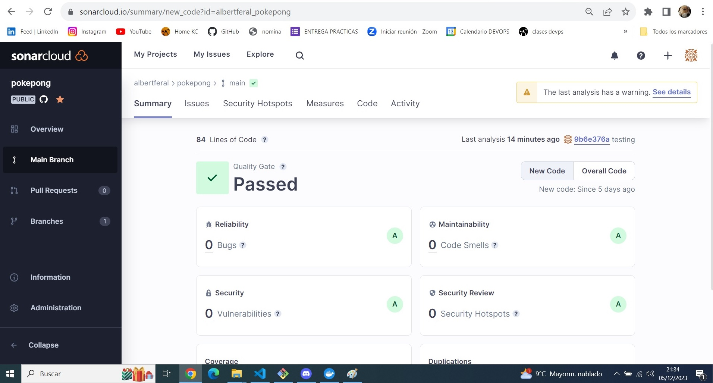
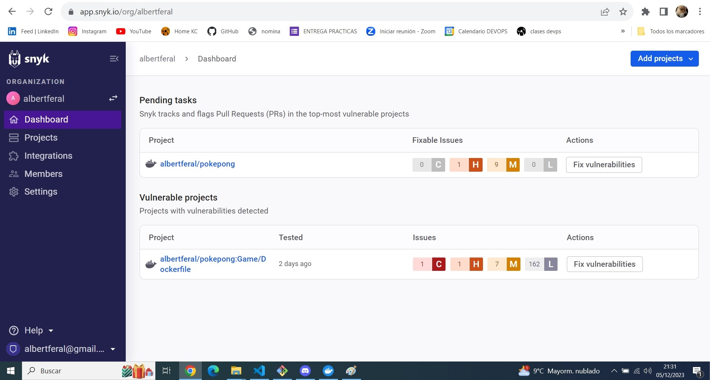
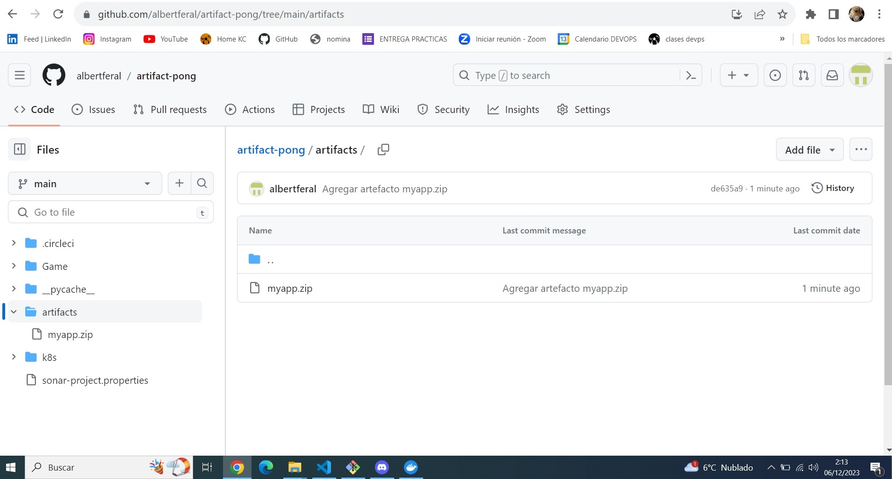
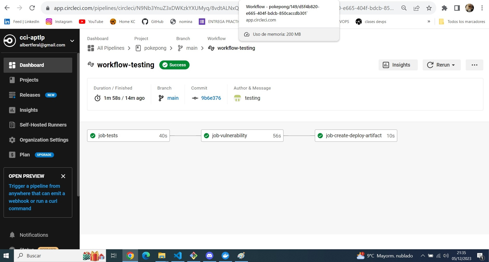
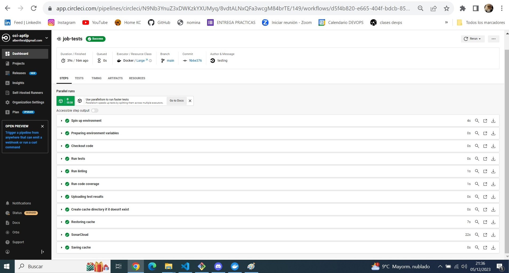
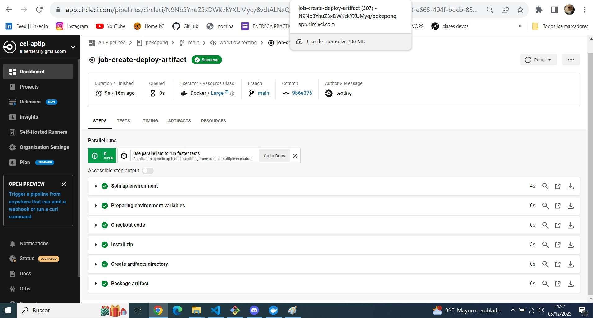
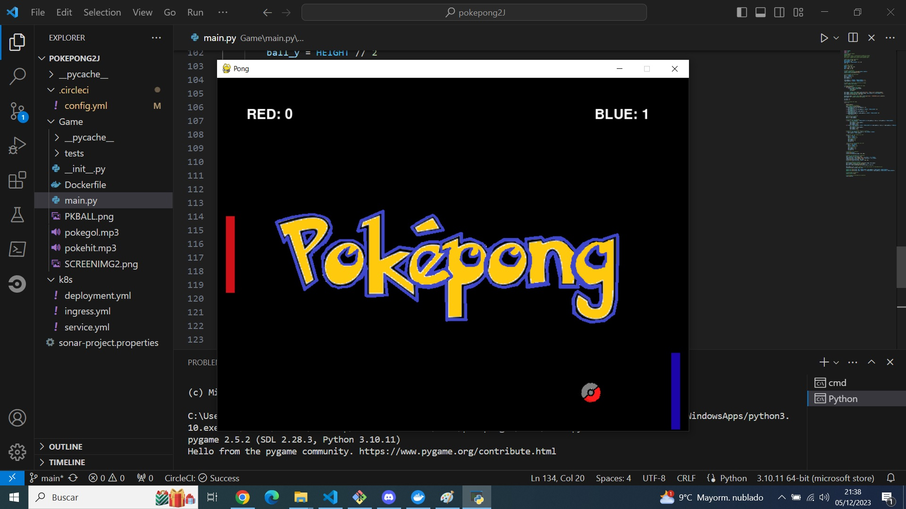
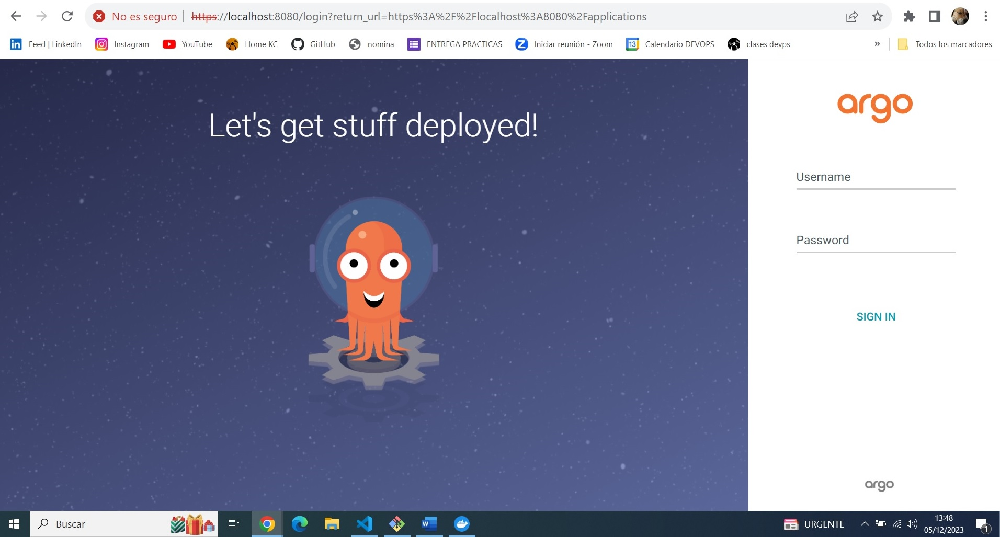
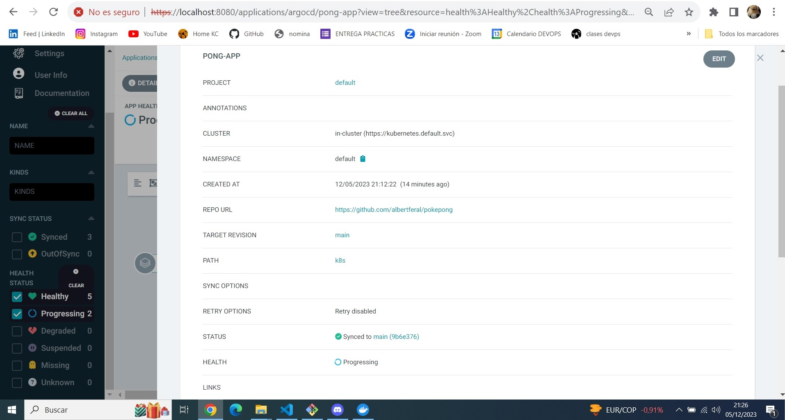
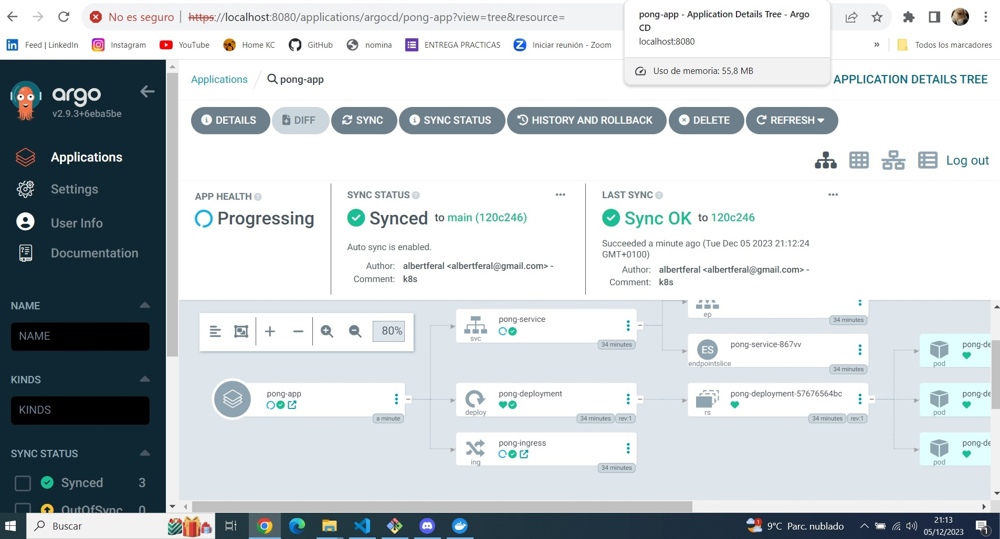

# Proyecto CI-CD KeepCoding - Albert Fernández

#### En este proyecto implementamos un pipeline de CircleCI que use distintos recursos para una app hecha en PyGame.

## Estructura: 
#### Se divide en 3 directorios principales:
## .circleci
 - Directorio principal del pipeline. >> [Pipeline aquí](.circleci)

    -  Construye la app y ejecuta los tests necesarios (pytest, linting y code coverage).
    -  Se sincroniza con SonarCloud para hacer un analisis del código completo, para ello usamos su Orb.

    
    
    
    
    -  Se sincroniza con Snyk para hacer un analisis de vulnerabilidades del código.
    
    
    
    
    
    -  Terminamos generando nuestro artefacto en .zip y publicándolo directamente a Git.
    
    
    
    -  Todo el Workflow es dependiente, no se puede ejecutar un trabajo hasta que termine el anterior.

    
    
    
    
    

## Game: 
- Directorio principal en el que se encuentra la app y todas sus dependencias y requerimientos. >> [App aquí](Game)
    -  Para correr le aplicación de Pokepong lo puedes hacer mediante VSC. (Play en main.py)

    

    -  Tenemos el subdirectorio tests donde se crean las prubeas para pytest, linting, etc...

## k8s: 
- En este directorio tenemos los manifiestos yml para el despliegue de la app en Kubernetes. >> [Manifiestos aquí](k8s)
    - Consta de 3 sencillos archivos yml para poder lanzar la app a un cluster de Kubernetes.
    - Lo desplegamos en ArgoCD:

    

    

    